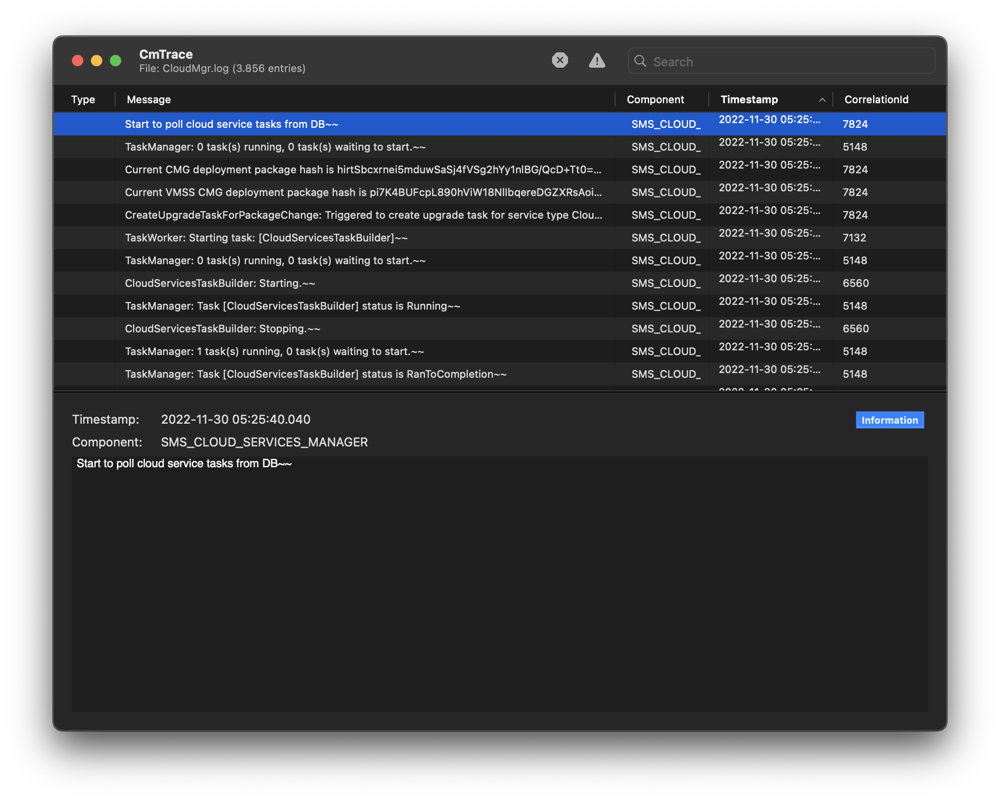

# CmTrace

This is a macOS clone of the Configuration Manager log viewer for Windows. It parses the log file tokens and displays the result in a easily readable table structure. The app provides sorting, filtering as well as highlighting error or warning messages that have specified tokens within the log message.

The main purpose of this project is to learn Swift and macOS programming with a real life project. I'm a macOS user who administers Configuration Manager within client environments. Therefore this tool helps me to view the logs on my mac without the need to fire up a Windows machine.

# Contribute

Contributions are welcome.
